# Hi there, I'm Dan 👋

Welcome to my GitHub profile! I'm a passionate developer who loves building things, solving problems, and learning along the way.

---

<table>
<tr>
<td valign="top" width="55%">

### 💼 Experience

**Senior Software Engineer** — *Aumovio*
`Sep 2025 – Present` · Sibiu, Romania

**Senior Software Engineer** — *Continental*
`Sep 2022 – Sep 2025` · Sibiu, Romania

**Junior Software Engineer** — *Ausy Technologies*
`Dec 2020 – Jun 2021` · Sibiu, Romania

---

### 🎓 Education

**Master's Degree — Project Management** — *Faculty of Engineering, Sibiu*
`Oct 2023 – Jul 2025`

**Bachelor's Degree — Computer Science & Computer Engineering** — *Faculty of Engineering, Sibiu*
`Oct 2017 – Jul 2021`

</td>
<td valign="top" width="45%">

### GitHub Stats

</td>
</tr>
</table>

---

### 📫 Let's connect
  
